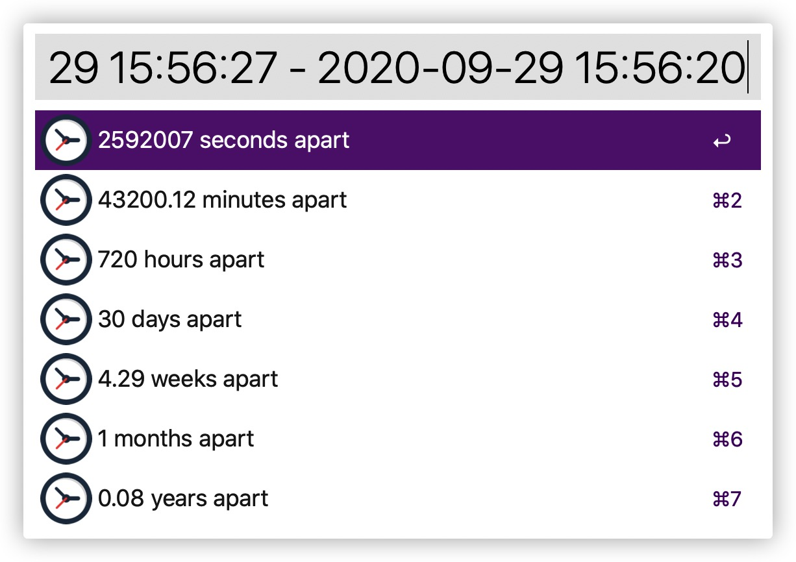

## Time-Helper

A Alfred Workflow for Time.

It's simple but useful.

## Function

There are many function in Time-Helper.

But you can just use it without any help.

Let's view the images.

## Supported version for Alfred

***>= 4.0.0***

I created it by the Alfred 4. 

The version bellow 4 may cannot work.

## Download

You can download from [Packal](http://www.packal.org/workflow/time-helper)，or click [here](https://github.com/hzh-cocong/Time-Helper/releases/download/v1.0.0/Time.Helper.alfredworkflow)

